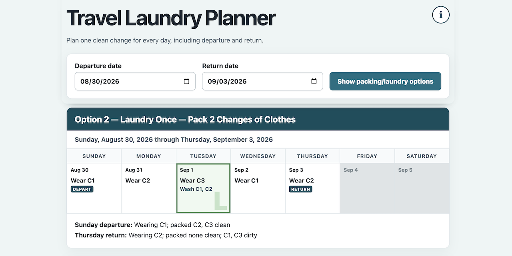

# Travel Laundry Planner

[Open the app page](https://jhinsdale.github.io/travel_laundry/travel_laundry.html)



Travel Laundry Planner makes a day-by-day clothing and laundry schedule for a
trip. Enter departure and return dates. The planner shows calendar weeks with what
to wear each day and which changes to wash.

The planner always includes a no-laundry option. It then shows only options that
reduce the packing load. Redundant laundry schedules are omitted.

## Use it

Download [`travel_laundry.html`](travel_laundry.html). Open it in a modern web
browser. No web server, installation, account, or internet connection is needed.

The browser URL updates when dates change. Share a planned trip using:

```text
travel_laundry.html?start=20260823&end=20260827
```

Opening that URL fills the dates and builds the calendars automatically.
Add `&nextday=1` when sent-out laundry comes back the next day.
Add `&selected=N` to select option N and scroll its calendar into view.

## How it works

- Departure and return dates both count as travel days.
- C1 is worn on departure. C2 and later changes start clean and packed.
- Laundry happens after the listed change is put on. The worn change is not washed.
- Optional next-day service plans for clothes that return after the following
  day's change is chosen. Its laundry day is the day clothes are sent out.
- Every listed day starts with a clean change.
- Travel dates are white. Non-travel dates in the displayed weeks are gray.
- Laundry dates carry a large **L**.
- The final option packs one change. More laundry cannot reduce the packing load.

Use the circled **i** button in the page for the same rules.

## Files

- `travel_laundry.html` — the complete application, including HTML, CSS, and JavaScript.
- `travel_laundry.png` — the application preview image shown above.
- `README.md` — this GitHub project overview.
